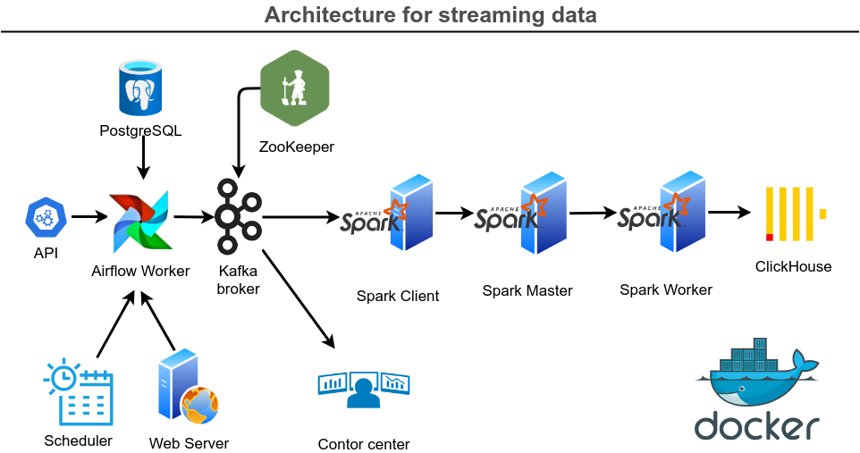

# 02_Streaming-Kafka

# Проект по постройке пайплайна для стриминга

## Описание проекта

Этот проект предназначен для демонстрации работы сервисов по сбору данных, обработке и передаче данных. 

## Стек технологий

- **Apache Airflow**: Оркестратор, который выполняет и отслеживает рабочие задачи, такие как обработка данных, уведомление о проблемах в задачах, хотя Airflow обычно используют для пайплайнов не включающих стриминг.
- **Apache Kafka**: Система обмена данными между участниками потоковой обработки.
- **Apache Zookeeper**: Централизованная служба для поддержки информации о конфигурации, именования, обеспечения синхронизации распределённых приложений.
- **Apache Spark**: Фреймворк, с помощью которого строятся приложения для распределённой обработки данных.
- **Apache ClickHouse**: Система управления базами данных, оптимизированная для аналитических запросов.
- **Docker**: Контейнеры Docker для простоты развёртывания и масштабирования.



## Инициализация

1. **Сборка контейнеров Docker**:
   - Соберите сеть контейнеров используя командную строку:
```bash
docker-compose up -d
```
2. **Запустить DAG на Веб-Сервере Airflow**:

**Link**: http://localhost:8080 \
**AIRFLOW_USER**: admin \
**AIRFLOW_PASSWORD**: admin

3. **Control center**:

Мониторинг Kafka брокера \
**Link**: http://localhost:9021 


4. **Spark Master**:

Мониторинг Spark приложений и выполняющих узлов \
**Link**: http://localhost:9090

4. **ClickHouse**:

**HOST**: localhost \
**CLICKHOUSE_USER**: admin \
**CLICKHOUSE_PASSWORD**: admin \
**CLICKHOUSE_DATABASE**: default